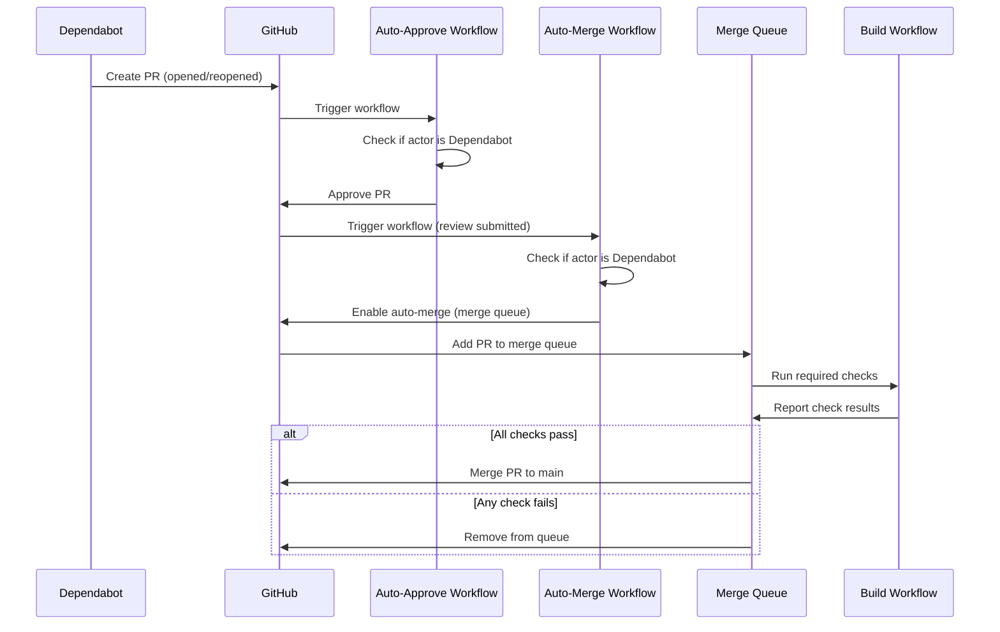

# Design Document: Dependabot Auto-Merge

## Overview

This feature implements automated approval and merging of Dependabot pull requests using two GitHub Actions workflows. The system leverages GitHub's merge queue to ensure safety while automating the dependency update process. The design consists of two independent workflows that work together: one for auto-approval and one for enabling auto-merge.

## Architecture

### High-Level Architecture



### Component Overview

1. **Auto-Approve Workflow** (`dependabot-auto-approve.yml`)
   - Triggers on PR opened/reopened events
   - Validates the PR actor is Dependabot
   - Approves the PR using GitHub CLI

2. **Auto-Merge Workflow** (`dependabot-auto-merge.yml`)
   - Triggers on PR review submitted events
   - Validates the PR actor is Dependabot
   - Enables auto-merge with merge queue method

3. **Merge Queue** (GitHub feature)
   - Managed by GitHub branch protection settings
   - Runs required status checks before merging
   - Serializes merges to prevent conflicts

## Components and Interfaces

### Auto-Approve Workflow

**File:** `.github/workflows/dependabot-auto-approve.yml`

**Trigger Configuration:**

```yaml
on:
  pull_request:
    types: [opened, reopened]
    branches:
      - main
```

**Permissions:**

```yaml
permissions:
  pull-requests: write
```

**Job Steps:**

1. Check if PR actor is `dependabot[bot]`
2. If yes, run `gh pr review --approve` using GITHUB_TOKEN
3. If no, skip approval

**Actor Validation Logic:**

```
if github.event.pull_request.user.login == 'dependabot[bot]'
```

### Auto-Merge Workflow

**File:** `.github/workflows/dependabot-auto-merge.yml`

**Trigger Configuration:**

```yaml
on:
  pull_request_review:
    types: [submitted]
```

**Permissions:**

```yaml
permissions:
  pull-requests: write
  contents: read
```

**Job Steps:**

1. Check if review state is `approved`
2. Check if PR actor is `dependabot[bot]`
3. If both conditions met, run `gh pr merge --auto --merge` using GITHUB_TOKEN
4. Otherwise, skip auto-merge enablement

**Conditional Logic:**

```
if github.event.review.state == 'approved' &&
   github.event.pull_request.user.login == 'dependabot[bot]'
```

### GitHub CLI Commands

**Approval Command:**

```bash
gh pr review $PR_NUMBER --approve
```

**Auto-Merge Command:**

```bash
gh pr merge $PR_NUMBER --auto --merge
```

The `--merge` flag specifies to use merge commits (not squash or rebase), which is compatible with the merge queue.

## Data Models

### GitHub Event Payloads

**Pull Request Event:**

```typescript
{
  action: 'opened' | 'reopened',
  pull_request: {
    number: number,
    user: {
      login: string  // 'dependabot[bot]' for Dependabot PRs
    }
  }
}
```

**Pull Request Review Event:**

```typescript
{
  action: 'submitted',
  review: {
    state: 'approved' | 'changes_requested' | 'commented'
  },
  pull_request: {
    number: number,
    user: {
      login: string
    }
  }
}
```

### Workflow Configuration Schema

Both workflows follow GitHub Actions YAML schema with these key elements:

- `name`: Workflow display name
- `on`: Event triggers with types and filters
- `permissions`: GITHUB_TOKEN permission scopes
- `jobs`: Job definitions with steps
- `if`: Conditional execution expressions

## Correctness Properties

_A property is a characteristic or behavior that should hold true across all valid executions of a system—essentially, a formal statement about what the system should do. Properties serve as the bridge between human-readable specifications and machine-verifiable correctness guarantees._

### Property 1: Approval is Dependabot-exclusive

_For any_ pull request event (opened or reopened), the Auto_Approve_Workflow should approve the PR if and only if the PR actor is `dependabot[bot]`.

**Validates: Requirements 1.1, 1.2**

### Property 2: Auto-merge is conditional on Dependabot and approval

_For any_ pull request review event, the Auto_Merge_Workflow should enable auto-merge if and only if the review state is `approved` and the PR actor is `dependabot[bot]`.

**Validates: Requirements 2.1, 2.3**

### Property 3: Uniform treatment of all Dependabot PRs

_For any_ Dependabot pull request, the workflow logic should not inspect PR labels, title, or body to differentiate between security updates and version updates - only the actor identity should be checked.

**Validates: Requirements 3.3**

### Property 4: Draft PRs are excluded

_For any_ pull request where the draft status is true, the workflows should not approve or enable auto-merge on the PR.

**Validates: Requirements 7.4**

## Error Handling

### Workflow Execution Failures

**Scenario:** GitHub CLI command fails (network issue, permission error, etc.)

**Handling:**

- Workflows will fail and report error in GitHub Actions UI
- PR will remain in its current state (not approved or auto-merge not enabled)
- Repository maintainers can manually approve and merge
- No automatic retry mechanism (GitHub Actions does not retry failed workflows by default)

### Invalid Actor Detection

**Scenario:** PR actor is not Dependabot

**Handling:**

- Workflow runs but skips approval/auto-merge steps due to conditional checks
- No error is raised (this is expected behavior)
- Workflow completes successfully with skipped steps

### Missing Permissions

**Scenario:** GITHUB_TOKEN lacks required permissions

**Handling:**

- GitHub CLI command will fail with permission error
- Workflow fails and reports error in Actions UI
- Solution: Verify workflow permissions are correctly declared

### Merge Queue Not Enabled

**Scenario:** Repository does not have merge queue enabled

**Handling:**

- `gh pr merge --auto --merge` command may fail or behave unexpectedly
- This is a configuration prerequisite that must be met
- Workflow should document this requirement clearly

### Multiple Approvals

**Scenario:** PR receives multiple approvals (from automation and humans)

**Handling:**

- GitHub allows multiple approvals
- Auto-merge workflow may trigger multiple times but `gh pr merge --auto` is idempotent
- No negative side effects from multiple auto-merge enablements

## Testing Strategy

### Unit Testing Approach

Since these are GitHub Actions workflows (YAML configuration), traditional unit testing is not applicable. Instead, testing focuses on:

1. **Static Configuration Validation**
   - Verify YAML syntax is valid
   - Verify trigger configurations match requirements
   - Verify permissions are correctly scoped
   - Verify conditional expressions are syntactically correct

2. **Integration Testing**
   - Test workflows in a real GitHub repository environment
   - Create test PRs with Dependabot actor simulation
   - Create test PRs with non-Dependabot actors
   - Verify approval and auto-merge behavior

3. **Manual Testing Scenarios**
   - Dependabot opens a version update PR → should auto-approve and auto-merge
   - Dependabot opens a security update PR → should auto-approve and auto-merge
   - Human opens a PR → should not auto-approve or auto-merge
   - Draft Dependabot PR → should not auto-approve or auto-merge

### Property-Based Testing Approach

Property-based testing for GitHub Actions workflows is challenging because:

- Workflows run in GitHub's infrastructure, not locally
- Cannot easily generate random GitHub events
- Cannot mock GitHub API responses in workflow context

**Alternative Validation Approach:**

1. **Configuration Property Tests** (can be implemented as scripts)
   - Parse YAML files and verify structural properties
   - Check that trigger events match specifications
   - Check that permissions are minimal and correct
   - Check that conditionals reference correct event properties

2. **Behavioral Property Tests** (require GitHub environment)
   - Property 1: Test with various actor names, verify only `dependabot[bot]` gets approved
   - Property 2: Test with various review states and actors, verify auto-merge only for approved Dependabot PRs
   - Property 3: Test with security and version update PRs, verify identical handling
   - Property 4: Test with draft and non-draft PRs, verify draft exclusion

**Testing Configuration:**

- Configuration validation scripts should run as pre-commit hooks or CI checks
- Behavioral tests should run in a test repository with simulated Dependabot PRs
- Each property test should verify the property holds across multiple test cases
- Minimum 5-10 test cases per property (limited by manual test setup overhead)

### Test Tagging

Each test should be tagged with:

```
Feature: dependabot-auto-merge, Property N: [property description]
```

Example:

```yaml
# Test for Property 1
# Feature: dependabot-auto-merge, Property 1: Approval is Dependabot-exclusive
```

## Repository Configuration Guide

### Required GitHub Settings

To enable this feature, the following repository settings must be configured:

#### 1. Enable Merge Queue

Navigate to: `Settings → General → Pull Requests`

- ✅ Enable "Merge queue"

#### 2. Configure Branch Protection for `main`

Navigate to: `Settings → Branches → Branch protection rules → main`

**Required settings:**

- ✅ Require a pull request before merging
- ✅ Require status checks to pass before merging
  - Add required status check: `lint-typecheck-format` (from build.yml)
- ✅ Require merge queue
- ✅ Do not allow bypassing the above settings

**Optional but recommended:**

- ✅ Require conversation resolution before merging
- ✅ Require linear history

#### 3. Workflow Permissions

Navigate to: `Settings → Actions → General → Workflow permissions`

**Ensure:**

- Default GITHUB_TOKEN permissions are set to "Read repository contents and packages permissions"
- ✅ Allow GitHub Actions to create and approve pull requests

This setting is required for the auto-approve workflow to function.

#### 4. Merge Methods

Navigate to: `Settings → General → Pull Requests`

**Ensure at least one merge method is enabled:**

- ✅ Allow merge commits (recommended for merge queue)
- Optional: Allow squash merging
- Optional: Allow rebase merging

The workflows use merge commits by default (`--merge` flag).

### Verification Checklist

After configuration, verify:

- [ ] Merge queue is enabled in repository settings
- [ ] Branch protection rule exists for `main` branch
- [ ] Branch protection requires status checks
- [ ] Branch protection requires merge queue
- [ ] Required status check `lint-typecheck-format` is configured
- [ ] GitHub Actions can create and approve pull requests
- [ ] At least one merge method is enabled
- [ ] Dependabot is enabled and configured

### Testing the Configuration

1. Wait for Dependabot to open a PR (or manually trigger Dependabot)
2. Verify the auto-approve workflow runs and approves the PR
3. Verify the auto-merge workflow runs and enables auto-merge
4. Verify the PR enters the merge queue
5. Verify required checks run in the merge queue
6. Verify the PR merges automatically after checks pass

## Implementation Notes

### GitHub CLI in Actions

The workflows use GitHub CLI (`gh`) which is pre-installed in GitHub Actions runners. The CLI automatically uses the `GITHUB_TOKEN` environment variable for authentication.

### Workflow Ordering

The two workflows are independent and can run in any order, but the typical sequence is:

1. PR opened → Auto-approve workflow runs → PR is approved
2. PR approved → Auto-merge workflow runs → Auto-merge enabled
3. Auto-merge enabled → PR enters merge queue → Checks run → PR merges

### Idempotency

Both workflows are idempotent:

- Approving an already-approved PR has no effect
- Enabling auto-merge on a PR with auto-merge already enabled has no effect

This means the workflows can safely run multiple times without causing issues.

### Dependabot Actor Identification

Dependabot uses the actor name `dependabot[bot]` in GitHub events. This is a stable identifier that can be reliably used for filtering.

Alternative Dependabot actor names (not used in this design):

- `dependabot-preview[bot]` (deprecated)
- Organization-specific Dependabot apps (rare)

The design assumes the standard `dependabot[bot]` actor name.
